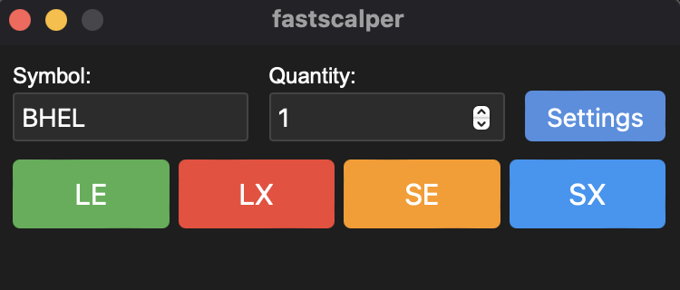

# FastScalper

FastScalper is a lightweight, cross-platform desktop application built with [Tauri](https://tauri.app/) and styled using custom CSS. It provides a streamlined interface for placing automated trading orders through the OpenAlgo API.



## Table of Contents

- [Features](#features)
- [Prerequisites](#prerequisites)
- [Installation](#installation)
- [Configuration](#configuration)
- [Usage](#usage)
- [Building the Application](#building-the-application)
- [Contributing](#contributing)
- [License](#license)

## Features

- Simple and intuitive UI for quick trading actions.
- Supports Long Entry (LE), Long Exit (LX), Short Entry (SE), and Short Exit (SX) operations.
- Customizable settings for API key, exchange, product type, and host URL.
- Voice alerts for trade actions (can be enabled/disabled in settings).
- Persistent settings using local storage.
- Cross-platform support (Windows, macOS, Linux).

## Prerequisites

Before you begin, ensure you have met the following requirements:

- **Node.js** (version 14 or later)
- **npm** (Node Package Manager)
- **Rust** and **Cargo** (Rust's package manager)
- **Tauri CLI** (Command Line Interface)

### Installing Rust and Cargo

Install Rust and Cargo by running:

```bash
# On Unix/Linux/macOS
curl --proto '=https' --tlsv1.2 -sSf https://sh.rustup.rs | sh

# On Windows, use the MSI installer from:
# https://static.rust-lang.org/rustup/dist/x86_64-pc-windows-msvc/rustup-init.exe
```

### Installing Tauri CLI

After installing Rust and Cargo, install the Tauri CLI:

```bash
cargo install tauri-cli
```

## Installation

Follow these steps to set up the FastScalper application:

1. **Clone the Repository**

   ```bash
   git clone https://github.com/marketcalls/fastscalper-tauri.git
   ```

2. **Navigate to the Project Directory**

   ```bash
   cd fastscalper-tauri
   ```

3. **Install Dependencies**

   ```bash
   npm install
   ```

## Configuration

### OpenAlgo API Setup

Ensure that the OpenAlgo API is running and accessible. By default, the application is configured to send requests to `http://127.0.0.1:5000/api/v1/placesmartorder`, but this can be changed in the settings.

### Tauri Configuration

The `tauri.conf.json` file contains configuration settings for the Tauri application. Key settings include window size, title, and bundle identifiers.

**Example `tauri.conf.json`:**

```json
{
  "build": {
    "withGlobalTauri": true
  },
  "package": {
    "productName": "FastScalper",
    "version": "0.1.0"
  },
  "tauri": {
    "allowlist": {
      "all": false
    },
    "windows": [
      {
        "title": "FastScalper",
        "width": 380,
        "height": 300,
        "resizable": false
      }
    ],
    "security": {
      "csp": null
    },
    "bundle": {
      "active": true,
      "targets": "all",
      "identifier": "com.fastscalper.app",
      "icon": [
        "icons/icon.icns",
        "icons/icon.ico"
      ]
    }
  }
}
```

## Usage

### Running the Application in Development Mode

To start the application in development mode with hot-reloading:

```bash
npm run tauri dev
```

### Application Interface

- **Symbol**: Enter the trading symbol (e.g., "BHEL").
- **Quantity**: Enter the quantity for the trade.

#### Trading Buttons

- **LE (Long Entry)**: Place a buy order with the specified quantity.
- **LX (Long Exit)**: Close a long position (sell order with zero quantity).
- **SE (Short Entry)**: Place a sell order with the specified quantity.
- **SX (Short Exit)**: Close a short position (buy order with zero quantity).

#### Settings

Click the **Settings** button to configure:

- **API Key**: Your OpenAlgo API key.
- **Exchange**: Select the exchange from the dropdown.
- **Product**: Select the product type (CNC, NRML, MIS).
- **Host URL**: Set the URL for the OpenAlgo API (default: http://127.0.0.1:5000).
- **Voice Alerts**: Enable or disable voice alerts for trade actions.

Settings are saved in local storage and persist between sessions.

### Placing an Order

1. Enter the **Symbol** and **Quantity**.
2. Click one of the trading buttons (**LE**, **LX**, **SE**, **SX**).
3. The application will send a request to the OpenAlgo API at the configured host URL.
4. An alert will display the response from the API.
5. If voice alerts are enabled, you'll hear a voice announcement of the action.

### Voice Alerts

FastScalper includes a voice alert feature that announces the trading action when a button is pressed. This feature can be enabled or disabled in the settings modal.

Voice alerts work across all supported platforms (Windows, macOS, and Linux) without any special configuration. The feature uses the Web Speech API, which is supported by modern web browsers and is compatible with Tauri's WebView component.

Voice alert messages:
- LE button: "Buy Order"
- LX button: "Buy Exit"
- SE button: "Short Order"
- SX button: "Short Exit"

Note: The quality and availability of voices may vary depending on the operating system and installed language packs. Most modern operating systems come with pre-installed voices, but users can add more voices through their system settings if desired.

## Building the Application

To build the application for distribution:

```bash
npm run tauri build
```

The built application will be located in the `src-tauri/target/release/bundle` directory, organized by platform.

## Project Structure

- **`src/`**: Contains the frontend code (HTML, CSS, JavaScript).
  - **`index.html`**: The main HTML file.
  - **`styles.css`**: Custom CSS styles.
  - **`main.js`**: JavaScript logic for the application, including voice alerts and API interactions.
- **`src-tauri/`**: Contains the Rust backend code.
  - **`src/main.rs`**: Rust source code handling API calls.
  - **`tauri.conf.json`**: Tauri configuration file.
  - **`Cargo.toml`**: Rust dependencies configuration.

## Dependencies

### JavaScript Dependencies

- **Tauri API**: Provides interaction between the frontend and backend.
- **Web Speech API**: Used for voice alerts (built into modern browsers).

### Rust Dependencies

- **tauri**: The core Tauri library.
- **serde**: For serialization and deserialization of data.
- **serde_json**: For handling JSON data.
- **reqwest**: For making HTTP requests.
- **tokio**: Asynchronous runtime for Rust.

**Cargo.toml Dependencies:**

```toml
[dependencies]
tauri = { version = "1", features = ["api-all"] }
serde = { version = "1", features = ["derive"] }
serde_json = "1"
reqwest = { version = "0.11", features = ["json", "default-tls"] }
tokio = { version = "1", features = ["macros", "rt-multi-thread"] }
```

## Contributing

Contributions are welcome! Please follow these steps:

1. **Fork the Repository**

   Click on the "Fork" button in the top right corner of the repository page.

2. **Create a Feature Branch**

   ```bash
   git checkout -b feature/YourFeatureName
   ```

3. **Commit Your Changes**

   ```bash
   git commit -m "Add your feature"
   ```

4. **Push to Your Fork**

   ```bash
   git push origin feature/YourFeatureName
   ```

5. **Create a Pull Request**

   Go to the original repository and click on "Pull Requests" to submit your PR.

## License

This project is licensed under the [MIT License](LICENSE).

## Acknowledgments

- [Tauri](https://tauri.app/) for providing the framework to build cross-platform desktop applications.
- [OpenAlgo](https://github.com/marketcalls/openalgo) for the trading API.
- All contributors and the open-source community.

## Contact

For support or inquiries, please open an issue on the [GitHub repository](https://github.com/marketcalls/fastscalper-tauri/issues).
